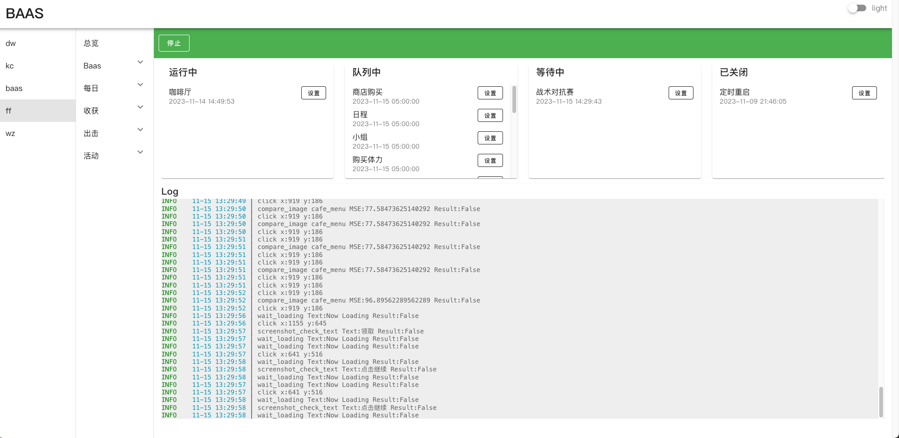

# Blue Archive Auto Script

> QQ交流群: 621628600

### 运行截图



## 更新日志
### 2023-11-24
- [x] **普通关卡-开图** 一键开图，直接⭐️⭐️⭐️
- [x] **统计悬赏** I关支持
- [x] **反和谐** 一键反和谐
- [x] **性能优化** 运行更加流畅
- [x] **0依赖** 不依赖任何客户端直接下载双击运行
### 2023-11-20
- [x] **主线剧情** 自动完成所有主线剧情
- [x] **咖啡厅** 添加是否领取体力选项
- [x] **商店** 购买体力逻辑优化
- [x] **GUI** 配置文件排序
- [x] **商店** 修复竞技场货币不足bug

### 2023-11-17

- [x] **小组** 自动打开小组，并签到
- [x] **邮箱** 一键领取邮箱全部奖励
- [x] **工作任务** 一键领取任务全部奖励
- [x] **日程** 根据所配置的学校课程，一键完成全部内容
- [x] **咖啡厅**
    - [x] 领取咖啡厅收益奖励
    - [x] 邀请学生
    - [x] 每隔一段时间自动互动
    - [x] 学生互动(已实现精确点击)
    - [ ] 邀请指定学生
- [x] **商店** 支持商品全自定义购买
    - [x] 常规道具购买
    - [x] 对抗赛道具购买
    - [x] 刷新商店
- [x] **购买体力** 支持任意次数的体力购买，可立即执行关联任务
- [x] **主线普通扫荡**：可指定任意主线关卡
- [x] **主线困难扫荡**：可指定任意主线关卡
- [x] **特别委托** 扫荡指定次数的任意委托任务
- [x] **通缉悬赏** 根据配置的关卡自动扫荡（暂不支持开图）
- [x] **竞技场** 清理到没有竞技场挑战券为止 (可选等级比自己低的策略)
- [x] **桃信** 自动完成所有未结束对话 完成剧情 领取青辉石
- [x] **制造** 可选择制造物品优先级和制造次数
- [x] **账号多开** 同时运行多个自动化脚本控制多个账号
- [x] **GUI** 图形化界面控制所有功能和配置
- [x] **最新活动补习部签到** 最新活动补习部签到

### 待开发功能

- [ ] **支线剧情** 自动完成所有支线
- [ ] **主线开图**：可指定开启主线关卡
- [ ] **三服支持** 增加对国际服和日服支持(看目前版本热度而定）

### 支持平台

- Windows
- MacOS Intl，M1，M2芯片

### 如何运行

1. [点我下载](https://github.com/baas-pro/baas/releases)对应系统的文件，解压到目录（不要有中文路径）
2. 双击运行即可，首次打开时间较长请耐心等待(确保exe文件和configs文件在同一级目录中)
3. 运行成功后会自动打开[http://localhost:1117](http://localhost:1117)地址。根据网页说明进行配置即可

### 打包

```bash
$ pyinstaller baas.spec
$ pyinstaller -F --name=baas --add-data 'assets:assets' --add-data 'web/static:web/static' --add-data 'web/templates:web/templates' --icon='assets/ba.ico' main.py
$ pyinstaller -w --name=baas --add-data 'assets:assets' --add-data 'web/static:web/static' --add-data 'web/templates:web/templates' --icon='assets/ba.icns' main.py
```

### 赞助

